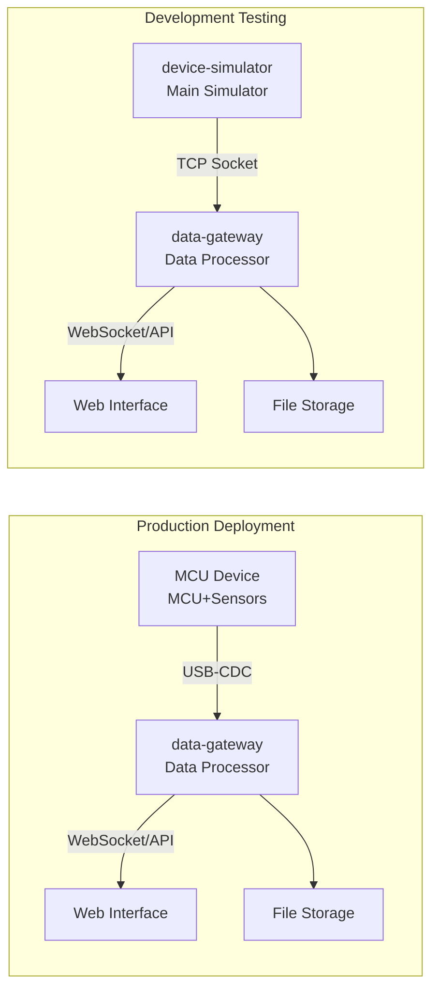
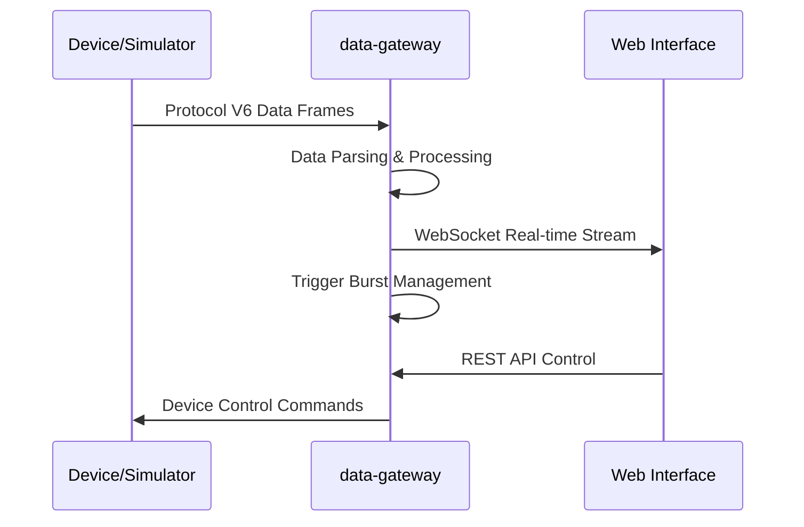

# Universal Data Acquisition System

[](LICENSE)
[](CHANGELOG.md)
[](https://www.rust-lang.org/)
[](docs/protocol_doc.md)

English | [简体中文](README.md)

**A real-time, high-performance data acquisition and processing system that supports the complete workflow from development testing to production deployment.**

---

## 📚 Quick Navigation

📖 [Protocol Docs](docs/protocol_doc.md) | 🔌 [API Docs](docs/api_doc.md) | 🏗️ [Architecture](docs/ARCHITECTURE.md) |
🚀 [Quick Start](#quick-start) | 💬 [FAQ](docs/FAQ.md) | 🤝 [Contributing](CONTRIBUTING.md) | 📝 [Changelog](CHANGELOG.md)

## System Architecture

### Deployment Modes



### Data Flow



## Project Structure

```
trigger-daq/
├── data-gateway/         # Core processor, Rust implementation
├── device-simulator/     # Main device simulator, C implementation
├── device-simulator-cli/ # Command/frame sender (formerly test-sender)
├── protocol-cli/         # Protocol-level debugging/reading tool
├── docs/                 # Protocol and API documentation
└── dashboards/           # Test/dashboard web pages
```

## Core Features

### Data Acquisition
- **Protocol V6**: Binary frame format with CRC16 checksum
- **Dual Connection**: USB-CDC Serial (production) + TCP Socket (development)
- **Trigger Mode**: Event-driven data acquisition
- **Continuous Mode**: Real-time data streaming

### Trigger Burst Management
- **Smart Caching**: Automatically manages last 10 trigger events
- **Data Preview**: WebSocket real-time push of completed bursts
- **Custom Save**: User selects filename, path, and format
- **Quality Assessment**: Automatic analysis of data integrity and signal quality

### Web Interface
- **REST API**: Device control, file management, burst operations
- **WebSocket**: Real-time data streaming and event notifications
- **Test Interface**: Complete functional testing webpage

## Quick Start

### Development Testing

```bash
# 1. Start device simulator
cd device-simulator-cli
make run

# 2. Start data processor
cd data-gateway
cargo run --release

# 3. Open test interface
# Browser: dashboards/dashboardv5.html
```

### Production Deployment

```bash
# 1. Compile MCU firmware
cd device-simulator-cli
make MODE=mcu flash

# 2. Configure serial connection
export DEVICE_TYPE=serial
export SERIAL_PORT=/dev/ttyUSB0

# 3. Start processor
cd data-gateway
cargo run --release
```

## Main APIs

### Device Control
```http
POST /api/control/trigger_mode    # Set trigger mode
POST /api/control/start           # Start acquisition
POST /api/control/stop            # Stop acquisition
GET  /api/control/status          # System status
```

### Trigger Management
```http
GET    /api/trigger/list                # Burst list
GET    /api/trigger/preview/{burst_id}  # Preview burst
POST   /api/trigger/save/{burst_id}     # Save burst
DELETE /api/trigger/delete/{burst_id}   # Delete burst
```

### File Operations
```http
GET  /api/files                  # File list
GET  /api/files/{filename}       # Download file
POST /api/files/save             # Save file
```

## Configuration

### Environment Variables
```bash
# Connection configuration
DEVICE_TYPE=socket                # serial/socket
SOCKET_ADDRESS=127.0.0.1:9001    # Socket address
SERIAL_PORT=COM7                  # Serial port

# Service configuration
WEB_PORT=8080                     # HTTP port
WS_PORT=8081                      # WebSocket port

# Storage configuration
DATA_DIR=./data                   # Data directory
TRIGGER_CACHE_SIZE=10             # Burst cache size
```

### Build Options
```bash
# Device simulator
make BUILD=release MODE=simulation  # PC version
make BUILD=release MODE=mcu        # MCU version

# Data processor
cargo build --release              # Optimized build
```

## Typical Use Cases

### Vibration Monitoring
Device continuously monitors vibration signals, automatically triggers data acquisition when anomalies are detected, captures 100ms of vibration data before and after, allowing users to preview data quality before saving.

### Impact Testing
In product drop testing, the impact sensor triggers acquisition when impact events are detected, automatically saves complete acceleration data before and after impact, supports export to CSV format for analysis software.

### Signal Analysis
Real-time monitoring of multi-channel signal quality, captures all channel data when trigger events occur, automatically assesses signal integrity, marks anomalous data for further analysis.

## Technology Stack

- **Device Layer**: C + Protocol V6 + CRC Checksum
- **Processing Layer**: Rust + Tokio Async + Serde Serialization
- **Web Layer**: Axum Framework + WebSocket + REST API
- **Frontend**: HTML5 + JavaScript + Chart.js

## Deployment Notes

### Hardware Requirements
- **Development**: Rust-compilable system, 4GB RAM
- **MCU Deployment**: STM32F4 or similar MCU, USB-CDC support
- **Transmission**: USB 2.0 or higher, stable power supply

### Performance Metrics
- **Sample Rate**: Up to 100kHz/channel (MCU mode)
- **Latency**: End-to-end <50ms
- **Throughput**: 1MB/s (simulation mode)
- **Concurrency**: Multiple WebSocket clients supported

### Troubleshooting
- **Device Connection**: Check serial port permissions and baud rate
- **Memory Insufficient**: Adjust TRIGGER_CACHE_SIZE to reduce cache
- **Data Loss**: Verify CRC checksum and frame integrity
- **WebSocket Disconnect**: Check firewall and proxy settings

## Contributing

We welcome contributions of all kinds! Please read our [Contributing Guide](CONTRIBUTING.md) to get started.

## License

This project is licensed under the Apache License 2.0 - see the [LICENSE](LICENSE) file for details.

## Documentation

- 📖 [Protocol Documentation](docs/protocol_doc.md) - Complete Protocol V6 specification
- 🔌 [API Documentation](docs/api_doc.md) - REST API and WebSocket interface reference
- 🏗️ [Architecture Documentation](docs/ARCHITECTURE.md) - System architecture and design
- 💬 [FAQ](docs/FAQ.md) - Frequently asked questions
- 📝 [Changelog](CHANGELOG.md) - Version history and updates

## Support

- 🐛 Report bugs: [GitHub Issues](https://github.com/edgedaq/trigger-daq/issues)
- 💡 Feature requests: Use feature request template
- ❓ Questions: Check FAQ or create a question issue

## Acknowledgments

Thanks to all contributors who have helped make this project better!

---

**Version**: 2.0 | **Last Updated**: 2024-12-31
