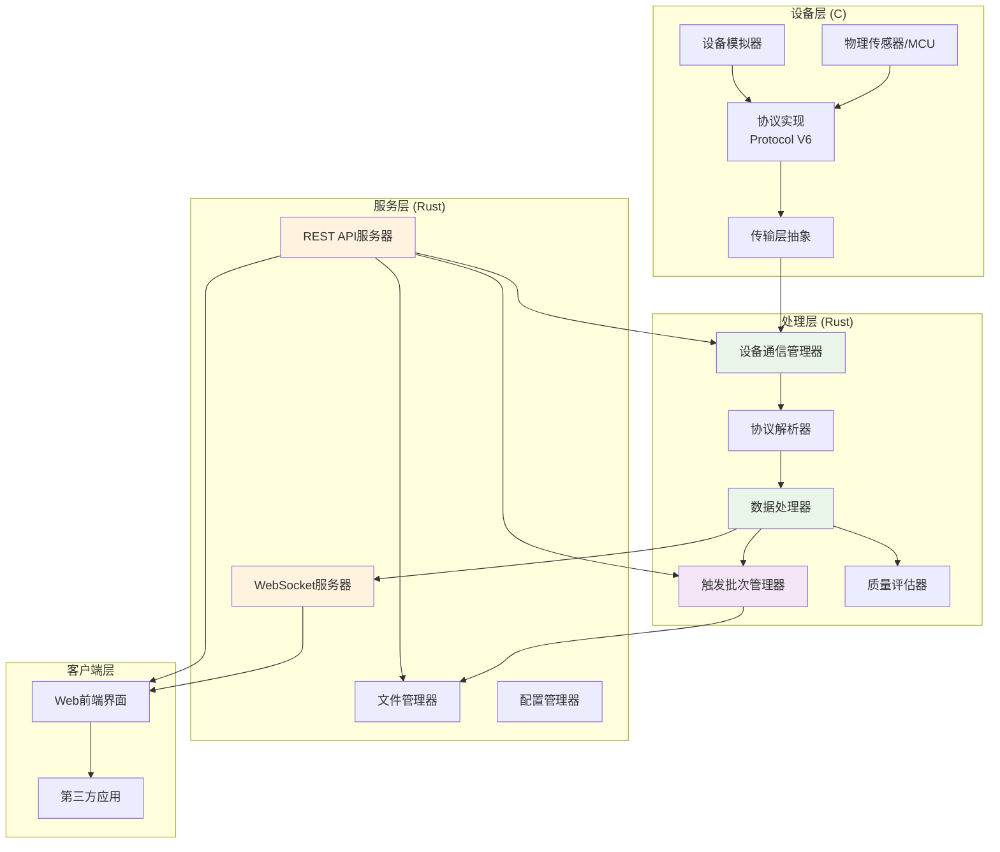
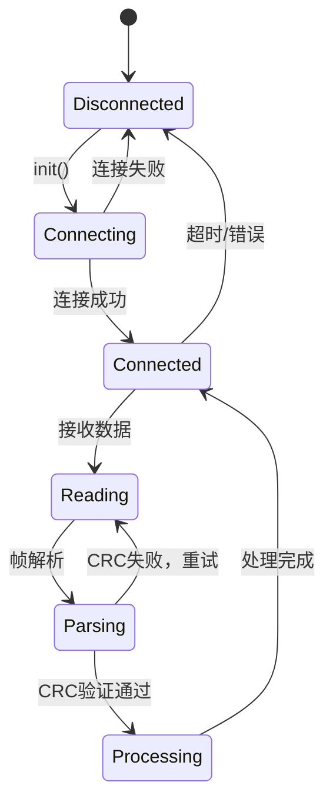
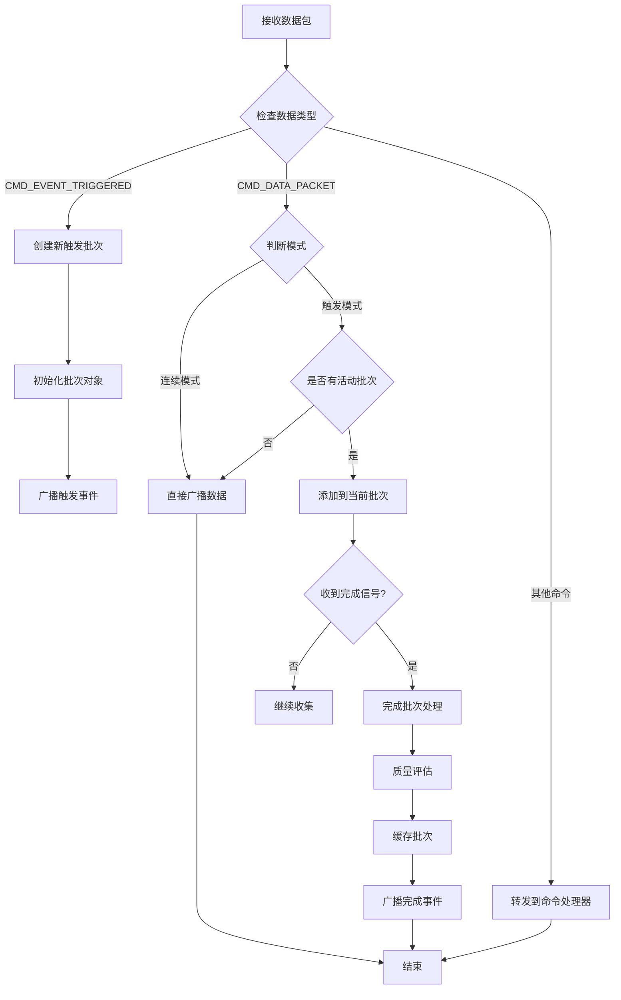
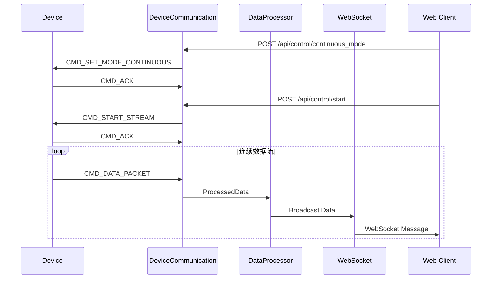
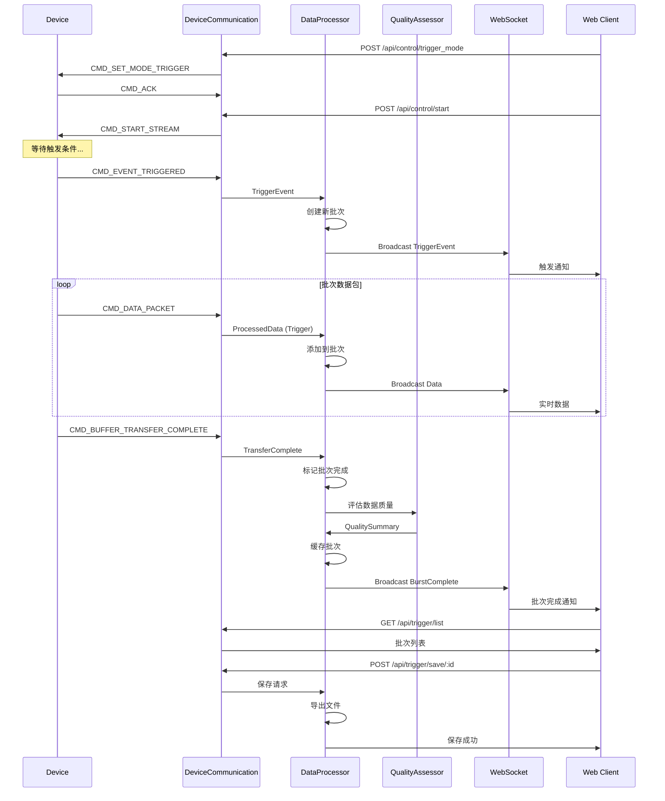
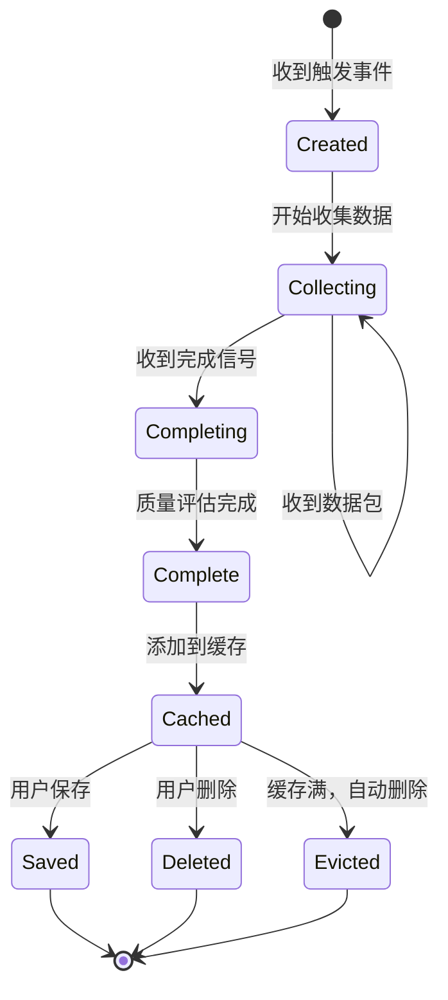

# 系统架构文档

本文档详细描述通用数据采集系统的整体架构、核心模块设计和关键技术决策。

## 目录

1. [系统概览](#系统概览)
2. [架构设计原则](#架构设计原则)
3. [核心模块](#核心模块)
4. [数据流设计](#数据流设计)
5. [触发批次管理](#触发批次管理)
6. [协议层设计](#协议层设计)
7. [存储架构](#存储架构)
8. [性能优化](#性能优化)
9. [扩展性设计](#扩展性设计)

---

## 系统概览

### 总体架构



### 部署架构

#### 开发/测试模式

```
┌─────────────────────┐
│  开发机器            │
│  ┌────────────────┐ │
│  │ device-simulator│ │ ←─ 模拟真实设备
│  └────────┬───────┘ │
│           │TCP      │
│  ┌────────▼───────┐ │
│  │  data-gateway   │ │ ←─ 数据处理核心
│  └────────┬───────┘ │
│           │HTTP/WS  │
│  ┌────────▼───────┐ │
│  │  Web Browser    │ │ ←─ 测试界面
│  └────────────────┘ │
└─────────────────────┘
```

#### 生产部署模式

```
┌─────────────┐      USB-CDC      ┌──────────────┐
│  MCU设备     │◄─────────────────►│  处理服务器   │
│  (固件)      │                   │  data-gateway│
│  - 传感器    │                   │  - 处理      │
│  - ADC      │                   │  - 存储      │
│  - Protocol │                   │  - API服务   │
└─────────────┘                   └──────┬───────┘
                                         │
                                         │ Network
                                         │
                                  ┌──────▼───────┐
                                  │  客户端       │
                                  │  - Web界面   │
                                  │  - 监控      │
                                  │  - 分析      │
                                  └──────────────┘
```

---

## 架构设计原则

### 1. 分层设计

系统采用经典的三层架构：

- **设备层**: 负责数据采集和协议实现
- **处理层**: 负责数据处理、缓存和业务逻辑
- **服务层**: 负责对外接口和用户交互

**优势:**
- 清晰的职责分离
- 易于测试和维护
- 支持独立升级

### 2. 模块化

每个功能模块高度独立：

- **协议层**: 独立的协议实现，可复用
- **传输层**: 抽象接口，支持多种传输方式
- **处理逻辑**: 与IO解耦，易于单元测试

**优势:**
- 降低耦合度
- 提高代码复用性
- 便于功能扩展

### 3. 异步架构

使用Rust的Tokio异步运行时：

- **异步IO**: 非阻塞的网络和串口通信
- **并发处理**: 同时处理多个客户端连接
- **资源高效**: 低内存占用，高吞吐量

**优势:**
- 高并发能力
- 低资源占用
- 优秀的响应性能

### 4. 事件驱动

系统核心采用事件驱动模型：

- **触发事件**: 异步事件通知
- **数据事件**: 流式数据处理
- **控制事件**: 命令响应机制

**优势:**
- 自然的异步处理
- 松耦合的组件交互
- 易于扩展事件类型

---

## 核心模块

### data-gateway 模块结构

```
src/
├── main.rs                  # 应用程序入口，初始化和启动
│   ├── 配置加载
│   ├── 日志初始化
│   └── 服务启动
│
├── config.rs                # 配置管理
│   ├── 环境变量解析
│   ├── 配置验证
│   └── 默认值处理
│
├── device_communication.rs  # 设备通信管理
│   ├── 串口/Socket连接管理
│   ├── 协议帧解析
│   ├── 命令发送/响应处理
│   └── 连接状态监控
│
├── data_processing.rs       # 数据处理和触发管理
│   ├── 实时数据处理
│   ├── 触发批次生命周期
│   ├── 数据缓存管理
│   └── 质量评估调度
│
├── web_server.rs            # REST API服务器
│   ├── 路由定义
│   ├── 请求处理器
│   ├── 错误处理
│   └── CORS配置
│
├── websocket.rs             # WebSocket服务
│   ├── 连接管理
│   ├── 消息广播
│   ├── 订阅控制
│   └── 心跳维护
│
└── file_manager.rs          # 文件存储管理
    ├── 文件列表
    ├── 文件读写
    ├── 格式转换
    └── 路径管理
```

### 1. device_communication.rs - 设备通信管理器

**职责:**
- 管理与设备的连接（Serial或Socket）
- 协议帧的解析和生成
- 命令发送和响应处理
- 连接状态监控和心跳

**关键数据结构:**

```rust
pub struct DeviceCommunication {
    // 连接类型和IO流
    connection_type: ConnectionType,
    serial_port: Option<SerialStream>,
    tcp_stream: Option<TcpStream>,

    // 协议解析状态
    rx_buffer: Vec<u8>,
    frame_parser: FrameParser,

    // 命令管理
    command_tx: mpsc::Sender<Command>,
    response_rx: mpsc::Receiver<Response>,

    // 状态监控
    last_packet_time: Instant,
    device_connected: Arc<AtomicBool>,
}
```

**核心流程:**



### 2. data_processing.rs - 数据处理器

**职责:**
- 实时数据处理和转换
- 触发批次生命周期管理
- 数据缓存和内存管理
- 质量评估调度

**关键数据结构:**

```rust
pub struct DataProcessor {
    // 当前工作模式
    mode: AcquisitionMode,  // Continuous / Trigger

    // 触发批次管理
    trigger_bursts: Arc<Mutex<HashMap<String, TriggerBurst>>>,
    current_burst: Option<String>,
    max_cache_size: usize,

    // 数据广播
    ws_broadcaster: Arc<WebSocketBroadcaster>,

    // 统计信息
    packets_processed: Arc<AtomicU64>,
    triggers_received: Arc<AtomicU32>,
}

pub struct TriggerBurst {
    pub burst_id: String,
    pub trigger_timestamp: u32,
    pub trigger_channel: u16,
    pub pre_samples: u32,
    pub post_samples: u32,
    pub data_packets: Vec<ProcessedData>,
    pub is_complete: bool,
    pub total_samples: usize,
    pub created_at: i64,
    pub quality_summary: Option<DataQualitySummary>,
}
```

**处理流程:**



### 3. web_server.rs - REST API服务器

**职责:**
- 提供HTTP RESTful API
- 处理设备控制请求
- 文件管理接口
- 触发批次操作

**路由设计:**

```rust
// 系统路由
GET  /              -> API信息
GET  /health        -> 健康检查

// 控制路由
GET  /api/control/status              -> 系统状态
POST /api/control/start               -> 启动采集
POST /api/control/stop                -> 停止采集
POST /api/control/ping                -> Ping设备
POST /api/control/device_info         -> 设备信息
POST /api/control/continuous_mode     -> 连续模式
POST /api/control/trigger_mode        -> 触发模式
POST /api/control/configure           -> 配置数据流

// 触发管理路由
GET    /api/trigger/list              -> 批次列表
GET    /api/trigger/preview/:id       -> 预览批次
POST   /api/trigger/save/:id          -> 保存批次
DELETE /api/trigger/delete/:id        -> 删除批次

// 文件管理路由
GET  /api/files                       -> 文件列表
GET  /api/files/:filename             -> 下载文件
POST /api/files/save                  -> 保存文件
```

### 4. websocket.rs - WebSocket服务器

**职责:**
- 实时数据流推送
- 事件通知广播
- 客户端连接管理
- 订阅控制

**消息类型:**

```rust
pub enum WebSocketMessage {
    // 系统消息
    Welcome { client_id: String, timestamp: i64 },
    Pong { timestamp: i64 },
    SubscriptionUpdated { subscriptions: Subscriptions },

    // 数据消息
    Data(ProcessedData),

    // 触发相关
    TriggerEvent {
        timestamp: u32,
        channel: u16,
        pre_samples: u32,
        post_samples: u32,
    },
    TriggerBurstComplete {
        burst_id: String,
        summary: TriggerBurstSummary,
        preview_samples: Vec<f32>,
    },
}
```

**订阅机制:**

```rust
pub struct ClientSubscriptions {
    pub data_stream: bool,         // 订阅数据流
    pub trigger_events: bool,      // 订阅触发事件
    pub trigger_bursts: bool,      // 订阅批次完成
    pub continuous_only: bool,     // 仅连续模式
    pub trigger_only: bool,        // 仅触发模式
}
```

### 5. file_manager.rs - 文件管理器

**职责:**
- 文件列表管理
- 多格式数据导出
- 路径安全处理
- 文件元数据管理

**导出格式:**

```rust
pub enum ExportFormat {
    Json,      // JSON格式，包含完整元数据
    Csv,       // CSV格式，适合数据分析
    Binary,    // 二进制格式，原始数据
}

impl FileManager {
    pub fn export_trigger_burst(
        &self,
        burst: &TriggerBurst,
        format: ExportFormat,
        path: PathBuf,
    ) -> Result<PathBuf>;
}
```

---

## 数据流设计

### 连续模式数据流



### 触发模式数据流



---

## 触发批次管理

### 批次生命周期



### 缓存管理策略

**LRU (Least Recently Used) 策略:**

```rust
impl TriggerBurstCache {
    fn add_burst(&mut self, burst: TriggerBurst) {
        if self.bursts.len() >= self.max_size {
            // 移除最旧的批次
            if let Some(oldest_id) = self.get_oldest_burst_id() {
                self.bursts.remove(&oldest_id);
                log::info!("Evicted oldest burst: {}", oldest_id);
            }
        }

        self.bursts.insert(burst.burst_id.clone(), burst);
    }
}
```

**内存监控:**

```rust
impl DataProcessor {
    fn check_memory_usage(&self) -> usize {
        let mut total_size = 0;
        for burst in self.trigger_bursts.lock().values() {
            total_size += burst.estimate_memory_size();
        }
        total_size
    }

    fn auto_cleanup_if_needed(&mut self) {
        if self.check_memory_usage() > MAX_CACHE_MEMORY {
            self.cleanup_old_bursts();
        }
    }
}
```

### 质量评估

**评估维度:**

```rust
pub struct DataQualitySummary {
    pub overall_quality: QualityStatus,  // Good/Warning/Error
    pub channel_stats: Vec<ChannelStats>,
    pub voltage_range: (f32, f32),
    pub anomaly_count: usize,
    pub completeness: f32,  // 0.0-1.0
}

pub struct ChannelStats {
    pub channel_id: u8,
    pub sample_count: usize,
    pub min_value: f32,
    pub max_value: f32,
    pub avg_value: f32,
    pub rms_value: f32,
    pub saturation_ratio: f32,
    pub flatness_ratio: f32,
}
```

**评估算法:**

```rust
impl QualityAssessor {
    pub fn assess(&self, burst: &TriggerBurst) -> DataQualitySummary {
        let mut summary = DataQualitySummary::default();

        for packet in &burst.data_packets {
            // 1. 电压范围检查
            self.check_voltage_range(packet, &mut summary);

            // 2. 饱和度检测
            self.check_saturation(packet, &mut summary);

            // 3. 平坦度检测
            self.check_flatness(packet, &mut summary);

            // 4. 数据完整性
            self.check_completeness(packet, &mut summary);

            // 5. 统计分析
            self.calculate_statistics(packet, &mut summary);
        }

        // 综合评估
        summary.overall_quality = self.determine_overall_quality(&summary);

        summary
    }
}
```

---

## 协议层设计

### 协议V6特点

**帧结构优势:**
- 固定的帧头和帧尾便于同步
- CRC16校验保证数据完整性
- 序列号支持请求/响应匹配
- 灵活的载荷支持多种数据类型

**命令分类:**
- 0x00-0x0F: 系统控制
- 0x10-0x1F: 采集配置
- 0x40-0x4F: 数据和事件
- 0x80-0x9F: 响应
- 0xE0-0xEF: 日志

详细协议规范见[protocol_doc.md](protocol_doc.md)。

### 传输层抽象

**接口设计:**

```c
// C语言传输层接口
typedef struct {
    int (*init)(void);
    int (*send)(const uint8_t* data, size_t len);
    int (*receive)(uint8_t* data, size_t max_len);
    void (*close)(void);
} transport_interface_t;
```

**实现方式:**
- `transport_tcp_client.c` - TCP Socket
- `transport_serial.c` - USB-CDC Serial (MCU固件)
- `transport_test.c` - 测试数据源

**优势:**
- 统一接口，易于切换
- 支持多种物理层
- 便于测试和仿真

---

## 存储架构

### 目录结构

```
data/
├── NILM_Dataset_V4/        # 测试数据集
├── test_output/            # 测试输出
└── experiments/            # 实验数据
    ├── 2024-12-31/        # 按日期分类
    │   ├── impact_001.csv
    │   ├── impact_001.json
    │   └── impact_001.bin
    └── vibration_test/     # 按实验分类
        ├── run_01.csv
        └── run_02.csv
```

### 文件格式

**JSON格式:**
```json
{
  "metadata": {
    "burst_id": "trigger_1704067200_1704067205000",
    "trigger_timestamp": 1704067200,
    "trigger_channel": 0,
    "total_samples": 1500,
    "created_at": "2024-01-01T00:00:05Z",
    "quality": "Good",
    "description": "冲击测试数据"
  },
  "data_packets": [...]
}
```

**CSV格式:**
```csv
timestamp,channel_0,channel_1,channel_2
1704067200000,1.23,1.24,1.25
1704067200001,1.26,1.27,1.28
...
```

**Binary格式:**
```
[Header: 64 bytes]
- magic: 0x44415441 ('DATA')
- version: 2
- burst_id: 32 bytes
- trigger_timestamp: 4 bytes
- channel_count: 1 byte
- sample_count: 4 bytes
- reserved: 19 bytes

[Data: Variable length]
- Channel 0 samples (raw int16/int32/float32)
- Channel 1 samples
- ...
```

---

## 性能优化

### 1. 异步IO

**零拷贝数据传输:**
```rust
// 使用Arc共享数据，避免拷贝
let data = Arc::new(ProcessedData::new());
self.ws_broadcaster.broadcast(data.clone()).await;
self.save_to_cache(data).await;
```

### 2. 内存池

**对象复用:**
```rust
// 数据包对象池
pub struct PacketPool {
    pool: Vec<Box<DataPacket>>,
    max_size: usize,
}

impl PacketPool {
    pub fn acquire(&mut self) -> Box<DataPacket> {
        self.pool.pop().unwrap_or_else(|| Box::new(DataPacket::new()))
    }

    pub fn release(&mut self, packet: Box<DataPacket>) {
        if self.pool.len() < self.max_size {
            self.pool.push(packet);
        }
    }
}
```

### 3. 批量处理

**批量数据处理:**
```rust
// 累积数据后批量写入
impl FileWriter {
    async fn write_batch(&mut self, packets: Vec<ProcessedData>) {
        let buffer = self.serialize_batch(&packets);
        self.file.write_all(&buffer).await?;
    }
}
```

### 4. 缓存策略

**热数据缓存:**
```rust
// 最近的批次保持在内存中
// 旧批次可以移到磁盘
impl TriggerBurstCache {
    fn hot_cache: HashMap<String, TriggerBurst>,  // 最近10个
    fn cold_storage: PathBuf,  // 磁盘存储路径
}
```

---

## 扩展性设计

### 1. 插件架构（未来）

**处理器插件:**
```rust
pub trait DataProcessor: Send + Sync {
    fn name(&self) -> &str;
    fn process(&self, data: &ProcessedData) -> Result<ProcessedData>;
}

// 用户可以实现自定义处理器
pub struct CustomProcessor;
impl DataProcessor for CustomProcessor {
    // ...
}
```

### 2. 协议版本协商

**自动适配:**
```rust
impl DeviceCommunication {
    async fn negotiate_protocol(&mut self) -> Result<u8> {
        // 查询设备协议版本
        let info = self.get_device_info().await?;

        // 选择兼容的协议版本
        let version = min(SUPPORTED_VERSION, info.protocol_version);

        log::info!("Using protocol version: {}", version);
        Ok(version)
    }
}
```

### 3. 微服务化（未来）

**模块化部署:**
```
┌─────────────┐     ┌─────────────┐     ┌─────────────┐
│ 设备网关     │────▶│ 数据处理    │────▶│  API服务     │
│ (采集)      │     │ (计算)      │     │ (对外)      │
└─────────────┘     └─────────────┘     └─────────────┘
      │                    │                   │
      └────────────────────┴───────────────────┘
                         │
                    消息队列/事件总线
```

---

## 技术决策记录

### 1. 为什么选择Rust？

**优势:**
- 内存安全，无GC开销
- 优秀的异步支持（Tokio）
- 高性能，接近C的速度
- 强类型系统，减少bug

**适用场景:**
- 长时间运行的服务
- 高并发网络服务
- 对性能和可靠性要求高

### 2. 为什么使用C实现设备层？

**优势:**
- MCU固件标准语言
- 轻量级，低资源占用
- 直接硬件访问
- 广泛的MCU支持

**适用场景:**
- 嵌入式系统
- 实时性要求高
- 资源受限环境

### 3. 为什么选择二进制协议？

**相比文本协议的优势:**
- 更高的传输效率
- 更低的解析开销
- 固定的帧结构，易于同步
- CRC校验保证完整性

**适用场景:**
- 高速数据传输
- 带宽受限环境
- 实时性要求高

### 4. 为什么使用触发批次管理？

**相比实时保存的优势:**
- 用户可预览数据质量
- 灵活的保存时机
- 减少磁盘IO
- 支持多格式导出

**适用场景:**
- 事件驱动的数据采集
- 需要数据质量评估
- 存储空间有限

---

## 未来演进

### 短期（v2.x）

- [ ] 数据压缩传输
- [ ] 增强的触发条件配置
- [ ] 性能监控仪表板
- [ ] 批量批次操作API

### 中期（v3.x）

- [ ] 插件系统
- [ ] 机器学习数据分析
- [ ] 多设备并发管理
- [ ] 云端数据同步

### 长期

- [ ] 分布式采集系统
- [ ] 微服务架构
- [ ] 实时流处理引擎
- [ ] 企业级数据平台

---

## 参考资料

- [协议规范](protocol_doc.md)
- [API文档](api_doc.md)
- [FAQ](FAQ.md)
- [贡献指南](../CONTRIBUTING.md)

---

**文档版本**: 1.0
**最后更新**: 2024-12-31
**维护者**: 项目团队
