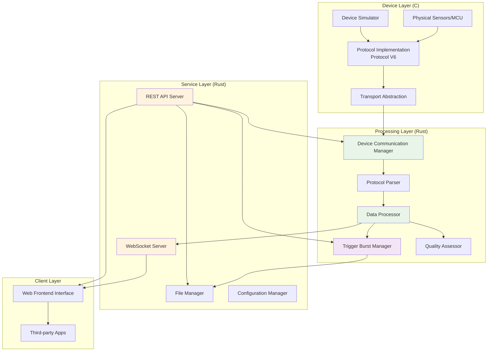
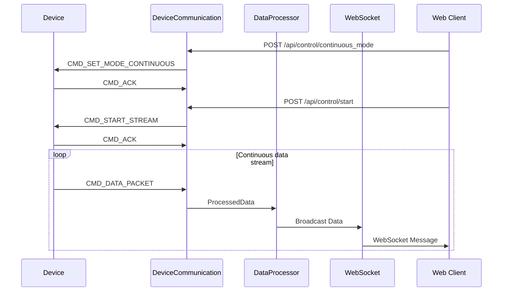
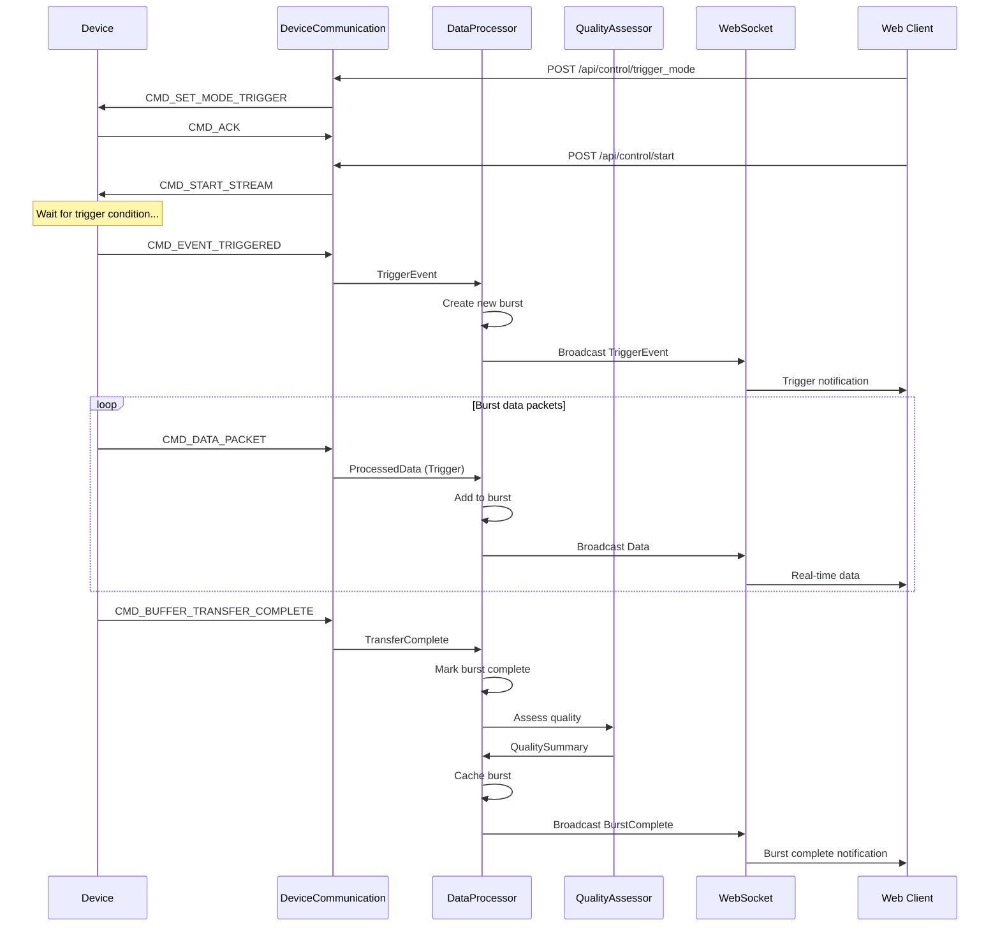
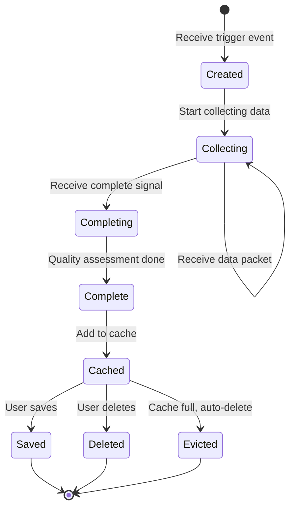

# System Architecture Documentation

English | [简体中文](ARCHITECTURE.md)

This document describes the overall architecture, core module design, and key technical decisions of the universal data acquisition system.

## Table of Contents

1. [System Overview](#system-overview)
2. [Architecture Design Principles](#architecture-design-principles)
3. [Core Modules](#core-modules)
4. [Data Flow Design](#data-flow-design)
5. [Trigger Burst Management](#trigger-burst-management)
6. [Protocol Layer Design](#protocol-layer-design)
7. [Storage Architecture](#storage-architecture)
8. [Performance Optimization](#performance-optimization)

---

## System Overview

### Overall Architecture



### Deployment Architectures

#### Development/Testing Mode

```
┌─────────────────────┐
│  Development Machine │
│  ┌────────────────┐ │
│  │ device-simulator│ │ ←─ Simulates real device
│  └────────┬───────┘ │
│           │TCP      │
│  ┌────────▼───────┐ │
│  │  data-gateway   │ │ ←─ Data processing core
│  └────────┬───────┘ │
│           │HTTP/WS  │
│  ┌────────▼───────┐ │
│  │  Web Browser    │ │ ←─ Test interface
│  └────────────────┘ │
└─────────────────────┘
```

#### Production Deployment Mode

```
┌─────────────┐      USB-CDC      ┌──────────────┐
│  MCU Device  │◄─────────────────►│  Processing  │
│  (Firmware)  │                   │  Server      │
│  - Sensors   │                   │  data-gateway│
│  - ADC       │                   │  - Process   │
│  - Protocol  │                   │  - Storage   │
└─────────────┘                   │  - API       │
                                   └──────┬───────┘
                                          │
                                          │ Network
                                          │
                                   ┌──────▼───────┐
                                   │  Clients     │
                                   │  - Web UI    │
                                   │  - Monitor   │
                                   │  - Analysis  │
                                   └──────────────┘
```

---

## Architecture Design Principles

### 1. Layered Design

System adopts classic three-tier architecture:

- **Device Layer**: Responsible for data acquisition and protocol implementation
- **Processing Layer**: Responsible for data processing, caching, and business logic
- **Service Layer**: Responsible for external interfaces and user interaction

**Advantages:**
- Clear separation of concerns
- Easy to test and maintain
- Supports independent upgrades

### 2. Modular Design

Each functional module is highly independent:

- **Protocol Layer**: Independent protocol implementation, reusable
- **Transport Layer**: Abstract interface, supports multiple transport methods
- **Processing Logic**: Decoupled from IO, easy to unit test

**Advantages:**
- Reduces coupling
- Improves code reusability
- Facilitates feature extension

### 3. Asynchronous Architecture

Uses Rust's Tokio async runtime:

- **Async IO**: Non-blocking network and serial communication
- **Concurrent Processing**: Handle multiple client connections simultaneously
- **Resource Efficient**: Low memory footprint, high throughput

**Advantages:**
- High concurrency capability
- Low resource usage
- Excellent responsiveness

### 4. Event-Driven

System core adopts event-driven model:

- **Trigger Events**: Async event notifications
- **Data Events**: Stream data processing
- **Control Events**: Command response mechanism

**Advantages:**
- Natural async handling
- Loosely coupled component interaction
- Easy to extend event types

---

## Core Modules

### data-gateway Module Structure

```
src/
├── main.rs                  # Entry point, initialization and startup
├── config.rs                # Configuration management
├── device_communication.rs  # Device communication management
├── data_processing.rs       # Data processing and trigger management
├── web_server.rs            # REST API server
├── websocket.rs             # WebSocket service
└── file_manager.rs          # File storage management
```

### 1. device_communication.rs - Device Communication Manager

**Responsibilities:**
- Manage connections with devices (Serial or Socket)
- Protocol frame parsing and generation
- Command sending and response handling
- Connection status monitoring and heartbeat

**Key Data Structure:**

```rust
pub struct DeviceCommunication {
    // Connection type and IO streams
    connection_type: ConnectionType,
    serial_port: Option<SerialStream>,
    tcp_stream: Option<TcpStream>,

    // Protocol parsing state
    rx_buffer: Vec<u8>,
    frame_parser: FrameParser,

    // Command management
    command_tx: mpsc::Sender<Command>,
    response_rx: mpsc::Receiver<Response>,

    // Status monitoring
    last_packet_time: Instant,
    device_connected: Arc<AtomicBool>,
}
```

### 2. data_processing.rs - Data Processor

**Responsibilities:**
- Real-time data processing and transformation
- Trigger burst lifecycle management
- Data caching and memory management
- Quality assessment scheduling

**Key Data Structure:**

```rust
pub struct DataProcessor {
    // Current working mode
    mode: AcquisitionMode,  // Continuous / Trigger

    // Trigger burst management
    trigger_bursts: Arc<Mutex<HashMap<String, TriggerBurst>>>,
    current_burst: Option<String>,
    max_cache_size: usize,

    // Data broadcasting
    ws_broadcaster: Arc<WebSocketBroadcaster>,

    // Statistics
    packets_processed: Arc<AtomicU64>,
    triggers_received: Arc<AtomicU32>,
}

pub struct TriggerBurst {
    pub burst_id: String,
    pub trigger_timestamp: u32,
    pub trigger_channel: u16,
    pub pre_samples: u32,
    pub post_samples: u32,
    pub data_packets: Vec<ProcessedData>,
    pub is_complete: bool,
    pub total_samples: usize,
    pub created_at: i64,
    pub quality_summary: Option<DataQualitySummary>,
}
```

### 3. web_server.rs - REST API Server

**Responsibilities:**
- Provide HTTP RESTful API
- Handle device control requests
- File management interface
- Trigger burst operations

**Route Design:**

```rust
// System routes
GET  /              -> API information
GET  /health        -> Health check

// Control routes
GET  /api/control/status              -> System status
POST /api/control/start               -> Start acquisition
POST /api/control/stop                -> Stop acquisition
POST /api/control/trigger_mode        -> Trigger mode
POST /api/control/configure           -> Configure stream

// Trigger management routes
GET    /api/trigger/list              -> Burst list
GET    /api/trigger/preview/:id       -> Preview burst
POST   /api/trigger/save/:id          -> Save burst
DELETE /api/trigger/delete/:id        -> Delete burst

// File management routes
GET  /api/files                       -> File list
GET  /api/files/:filename             -> Download file
POST /api/files/save                  -> Save file
```

### 4. websocket.rs - WebSocket Server

**Responsibilities:**
- Real-time data stream push
- Event notification broadcast
- Client connection management
- Subscription control

**Message Types:**

```rust
pub enum WebSocketMessage {
    // System messages
    Welcome { client_id: String, timestamp: i64 },
    Pong { timestamp: i64 },
    SubscriptionUpdated { subscriptions: Subscriptions },

    // Data messages
    Data(ProcessedData),

    // Trigger related
    TriggerEvent {
        timestamp: u32,
        channel: u16,
        pre_samples: u32,
        post_samples: u32,
    },
    TriggerBurstComplete {
        burst_id: String,
        summary: TriggerBurstSummary,
        preview_samples: Vec<f32>,
    },
}
```

### 5. file_manager.rs - File Manager

**Responsibilities:**
- File list management
- Multi-format data export
- Path security handling
- File metadata management

**Export Formats:**

```rust
pub enum ExportFormat {
    Json,      // JSON format with complete metadata
    Csv,       // CSV format for data analysis
    Binary,    // Binary format for raw data
}
```

---

## Data Flow Design

### Continuous Mode Data Flow



### Trigger Mode Data Flow



---

## Trigger Burst Management

### Burst Lifecycle



### Cache Management Strategy

**LRU (Least Recently Used) Strategy:**

```rust
impl TriggerBurstCache {
    fn add_burst(&mut self, burst: TriggerBurst) {
        if self.bursts.len() >= self.max_size {
            // Remove oldest burst
            if let Some(oldest_id) = self.get_oldest_burst_id() {
                self.bursts.remove(&oldest_id);
                log::info!("Evicted oldest burst: {}", oldest_id);
            }
        }

        self.bursts.insert(burst.burst_id.clone(), burst);
    }
}
```

### Quality Assessment

**Assessment Dimensions:**

```rust
pub struct DataQualitySummary {
    pub overall_quality: QualityStatus,  // Good/Warning/Error
    pub channel_stats: Vec<ChannelStats>,
    pub voltage_range: (f32, f32),
    pub anomaly_count: usize,
    pub completeness: f32,  // 0.0-1.0
}

pub struct ChannelStats {
    pub channel_id: u8,
    pub sample_count: usize,
    pub min_value: f32,
    pub max_value: f32,
    pub avg_value: f32,
    pub rms_value: f32,
    pub saturation_ratio: f32,
    pub flatness_ratio: f32,
}
```

---

## Protocol Layer Design

### Protocol V6 Features

**Frame Structure Advantages:**
- Fixed frame header and tail for easy synchronization
- CRC16 checksum ensures data integrity
- Sequence number supports request/response matching
- Flexible payload supports multiple data types

**Command Categories:**
- 0x00-0x0F: System control
- 0x10-0x1F: Acquisition configuration
- 0x40-0x4F: Data and events
- 0x80-0x9F: Responses
- 0xE0-0xEF: Logs

See detailed protocol specification in [protocol_doc_en.md](protocol_doc_en.md).

### Transport Layer Abstraction

**Interface Design:**

```c
// C language transport layer interface
typedef struct {
    int (*init)(void);
    int (*send)(const uint8_t* data, size_t len);
    int (*receive)(uint8_t* data, size_t max_len);
    void (*close)(void);
} transport_interface_t;
```

**Implementations:**
- `transport_tcp_client.c` - TCP Socket
- `transport_serial.c` - USB-CDC Serial (MCU firmware)
- `transport_test.c` - Test data source

**Advantages:**
- Unified interface, easy to switch
- Supports multiple physical layers
- Easy to test and simulate

---

## Storage Architecture

### Directory Structure

```
data/
├── NILM_Dataset_V4/        # Test dataset
├── test_output/            # Test output
└── experiments/            # Experiment data
    ├── 2024-12-31/        # Organized by date
    │   ├── impact_001.csv
    │   ├── impact_001.json
    │   └── impact_001.bin
    └── vibration_test/     # Organized by experiment
        ├── run_01.csv
        └── run_02.csv
```

### File Formats

**JSON Format:**
```json
{
  "metadata": {
    "burst_id": "trigger_1704067200_1704067205000",
    "trigger_timestamp": 1704067200,
    "trigger_channel": 0,
    "total_samples": 1500,
    "created_at": "2024-01-01T00:00:05Z",
    "quality": "Good",
    "description": "Impact test data"
  },
  "data_packets": [...]
}
```

**CSV Format:**
```csv
timestamp,channel_0,channel_1,channel_2
1704067200000,1.23,1.24,1.25
1704067200001,1.26,1.27,1.28
...
```

**Binary Format:**
```
[Header: 64 bytes]
- magic: 0x44415441 ('DATA')
- version: 2
- burst_id: 32 bytes
- trigger_timestamp: 4 bytes
- channel_count: 1 byte
- sample_count: 4 bytes
- reserved: 19 bytes

[Data: Variable length]
- Channel 0 samples (raw int16/int32/float32)
- Channel 1 samples
- ...
```

---

## Performance Optimization

### 1. Asynchronous IO

**Zero-copy data transfer:**
```rust
// Use Arc to share data, avoid copying
let data = Arc::new(ProcessedData::new());
self.ws_broadcaster.broadcast(data.clone()).await;
self.save_to_cache(data).await;
```

### 2. Object Pool

**Object reuse:**
```rust
// Data packet object pool
pub struct PacketPool {
    pool: Vec<Box<DataPacket>>,
    max_size: usize,
}

impl PacketPool {
    pub fn acquire(&mut self) -> Box<DataPacket> {
        self.pool.pop().unwrap_or_else(|| Box::new(DataPacket::new()))
    }

    pub fn release(&mut self, packet: Box<DataPacket>) {
        if self.pool.len() < self.max_size {
            self.pool.push(packet);
        }
    }
}
```

### 3. Batch Processing

**Batch data processing:**
```rust
// Accumulate data then write in batch
impl FileWriter {
    async fn write_batch(&mut self, packets: Vec<ProcessedData>) {
        let buffer = self.serialize_batch(&packets);
        self.file.write_all(&buffer).await?;
    }
}
```

### 4. Caching Strategy

**Hot data caching:**
```rust
// Recent bursts kept in memory
// Old bursts can be moved to disk
impl TriggerBurstCache {
    fn hot_cache: HashMap<String, TriggerBurst>,  // Recent 10
    fn cold_storage: PathBuf,  // Disk storage path
}
```

---

## Technical Decisions

### 1. Why Rust?

**Advantages:**
- Memory safe, no GC overhead
- Excellent async support (Tokio)
- High performance, close to C speed
- Strong type system, reduces bugs

**Use cases:**
- Long-running services
- High concurrency network services
- High performance and reliability requirements

### 2. Why C for device layer?

**Advantages:**
- Standard language for MCU firmware
- Lightweight, low resource usage
- Direct hardware access
- Wide MCU support

**Use cases:**
- Embedded systems
- High real-time requirements
- Resource-constrained environments

### 3. Why binary protocol?

**Advantages over text protocol:**
- Higher transmission efficiency
- Lower parsing overhead
- Fixed frame structure, easy to sync
- CRC checksum ensures integrity

**Use cases:**
- High-speed data transfer
- Bandwidth-limited environments
- High real-time requirements

### 4. Why trigger burst management?

**Advantages over real-time save:**
- User can preview data quality
- Flexible save timing
- Reduces disk IO
- Supports multi-format export

**Use cases:**
- Event-driven data acquisition
- Need data quality assessment
- Limited storage space

---

## Future Evolution

### Short-term (v2.x)

- [ ] Data compression transmission
- [ ] Enhanced trigger condition configuration
- [ ] Performance monitoring dashboard
- [ ] Batch burst operation API

### Medium-term (v3.x)

- [ ] Plugin system
- [ ] Machine learning data analysis
- [ ] Multi-device concurrent management
- [ ] Cloud data sync

### Long-term

- [ ] Distributed acquisition system
- [ ] Microservices architecture
- [ ] Real-time stream processing engine
- [ ] Enterprise data platform

---

## References

- [Protocol Specification](protocol_doc_en.md)
- [API Documentation](api_doc_en.md)
- [FAQ](FAQ_en.md)
- [Contributing Guide](../CONTRIBUTING.md)

---

**Documentation Version**: 1.0
**Last Updated**: 2025-01-07
**Maintainer**: Project Team
